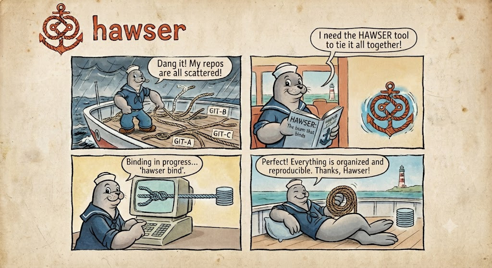

<!-- markdownlint-disable MD033 MD041 -->
<div align="center">



# hawser

**Reproducible multi-repo stacks + cross-repo PR/MR orchestration. One binary, one TUI. In Rust.**

[](.github/workflows/ci.yml)
[](https://www.rust-lang.org)
[](#license)
[](Cargo.toml)
[](https://nastwinns.github.io/keelson/docs/)

[Install](#install) · [Quick start](#quick-start) · [Demos](#demos) ·
[Docs](https://nastwinns.github.io/keelson/docs/) ·
[Try the TUI in your browser](https://nastwinns.github.io/keelson/)

</div>

---

`haw` assembles a software stack out of many independent Git repositories — without
submodules, without detached HEADs, without a Python runtime. A declarative manifest
(`haw.toml`) describes **stacks** and the **repos** they are composed of; a committed
lockfile (`haw.lock`) pins every repo to an exact revision, so any teammate or CI
machine reproduces the exact same tree.

On top of composition, `haw` drives the day-to-day multi-repo workflow: branch a
feature across all affected repos at once, open the linked PRs/MRs on GitHub **and**
GitLab, and track review + CI state from one keyboard-driven cockpit.

## Highlights

- **Reproducible.** `haw.lock` pins every repo to a SHA — byte-identical run-to-run,
  cross-OS (a real argument in automotive/avionics audits).
- **No magic on disk.** Repos are plain, autonomous clones. No symlinks, no detached
  HEAD — works on Windows where `repo` struggled.
- **Stacks compose.** Named sets of repos share the same clones; overlays override
  revs per variant without duplicating repo lists.
- **Changesets.** One feature across N repos: one branch everywhere, N cross-linked
  PR/MRs, one aggregated status, `land` merges in dependency order.
- **A k9s-grade TUI.** Bare `haw` opens the fleet cockpit: live grid, `/` filter,
  `:` command bar, fleet-wide PR/MR (`m`) and CI (`i`) views, `o` opens the row in
  your browser.
- **Fast and native.** Reads go through [gitoxide](https://github.com/GitoxideLabs/gitoxide);
  only the heavy plumbing shells out to `git`. Parallel `sync`/`run`/`build`/`test`.
- **CI-friendly.** `haw verify` exits 3 on drift, `--format json` where it matters,
  `NO_COLOR`/`CLICOLOR_FORCE` honored like `bat`, `eza`, `ripgrep`.

## Demos

Rendered with [VHS](https://github.com/charmbracelet/vhs) from the tapes in
[`demo/`](demo/) — CI re-renders them on every CLI/TUI change, so they never lie.

**The CLI** — `sync`, `tree`, `status`, cross-repo changesets, in full color:


**The TUI cockpit** — bare `haw`, k9s-style, keyboard-first:


**[Try the cockpit in your browser →](https://nastwinns.github.io/keelson/)** — real
ratatui widgets over [Ratzilla](https://github.com/ratatui/ratzilla), Rust compiled
to WASM, no server. Source: [`site/`](site/).

### Guided walkthroughs

Feature-by-feature tapes, paced to read along ([`demo/`](demo/)):

| Tape | Teaches |
|------|---------|
| [`cli-compose`](demo/cli-compose.gif) | `tree` → `sync` → `status` → `lock` → `pin` → `switch` — the composition lifecycle |
| [`cli-changeset`](demo/cli-changeset.gif) | `change start` / `status` across repos; where `request` / `land` open PR/MRs |
| [`cli-run-verify`](demo/cli-run-verify.gif) | parallel `run`, and `verify` as a CI drift gate (exit 3) |
| [`cli-merge`](demo/cli-merge.gif) | the collaborative merge: `plan` → `resolve` → `cleanup` |

The TUI demo above runs against a built-in demo controller (`haw dash --demo`) — no
workspace, git, or network — so the fleet PR/MR and CI views are always populated.

## Install

```bash
cargo install --git https://github.com/Nastwinns/keelson hawser   # from source (today)
cargo install hawser                                              # from crates.io (soon)
```

Prebuilt archives land in [`dist/`](dist/) per release; Homebrew/Scoop are on the
[roadmap](docs/COMMERCIALIZATION.md).

## Quick start

```bash
haw init haw.toml     # bootstrap a workspace from a manifest
haw sync              # clone every repo, write haw.lock
haw                   # open the TUI cockpit
```

A typical session — compose, inspect, branch across repos:

```console
$ haw tree
haw.toml
├─ gateway
│  ├─ kernel    v6.1.2       (git@gitlab.company.com:firmware/kernel.git)
│  ├─ hal       main         (git@gitlab.company.com:firmware/hal.git)
│  └─ app-mqtt  release/2.x  (git@github.com:acme/app-mqtt.git)
└─ sensor-node
   ├─ kernel  v6.1.2         (git@gitlab.company.com:firmware/kernel.git)
   └─ hal     main           (git@gitlab.company.com:firmware/hal.git)

$ haw status
REPO      BRANCH   HEAD      DIRTY  DRIFT
kernel    v6.1.2   a1b2c3d4  -      -
hal       main     9f8e7d6c  yes    -
app-mqtt  release  4d5e6f7a  -      YES

$ haw change start FEAT-42 --repos kernel,app-mqtt
changeset `FEAT-42` started across 2 repo(s):
  kernel    -> change/FEAT-42
  app-mqtt  -> change/FEAT-42
```

Color on a TTY, plain when piped, `NO_COLOR` honored — one shared scheme everywhere:
**cyan** repo/stack names, **yellow** revs and branches, dim SHAs, **green** ✓ clean,
**yellow** dirty, **red** drift.

## How it composes

One manifest declares **repos** (the Git repositories) and composes them into
**stacks** (named sets of repos). A repo is shared, never duplicated. A committed
lockfile pins every repo to an exact SHA.

```
              haw.toml  (intent)                 haw.lock  (pinned SHAs, committed)
                   │                                        │
      ┌────────────┼────────────┐                          ▼
      ▼            ▼            ▼                   reproducible on any machine / CI
 ┌─────────┐  ┌─────────┐  ┌──────────┐
 │ kernel  │  │  hal    │  │ app-mqtt │   ← repos (full autonomous git clones)
 └────┬────┘  └────┬────┘  └────┬─────┘
      │            │            │
      ├──────┬─────┤            │          stacks reuse the SAME repos,
      ▼      │     ▼            ▼          no submodules, no detached HEAD, no symlinks
 ┌──────────┴──┐  ┌────────────┴─────┐
 │  gateway    │  │   sensor-node    │   ← stacks (compositions)
 │ kernel+hal  │  │   kernel + hal   │
 │  +app-mqtt  │  │                  │
 └─────────────┘  └──────────────────┘
```

On disk — no symlinks, ever:

```
mystack/
├── haw.toml            # manifest (intent)
├── haw.lock            # lockfile (resolved SHAs, committed)
├── kernel/             # real, complete git repo
├── hal/                # real, complete git repo
└── app-mqtt/           # real, complete git repo
```

Object sharing across stacks on one machine is an **opt-in optimization** via git's
native `alternates` (`git clone --reference`) — a text file, not a symlink.

## Manifest example

```toml
[remote.internal]
url = "git@gitlab.company.com:firmware"

[repo.kernel]
remote = "internal"
repo   = "kernel.git"
rev    = "v6.1.2"        # tag or sha => pinned & reproducible
groups = ["firmware"]

[repo.hal]
remote = "internal"
repo   = "hal.git"
rev    = "main"          # branch => follows head, until locked

[repo.app-mqtt]
url    = "git@github.com:acme/app-mqtt.git"
rev    = "release/2.x"
path   = "apps/mqtt"     # optional; defaults to the repo name

[stack.gateway]
repos = ["kernel", "hal", "app-mqtt"]

[stack.sensor-node]
repos = ["kernel", "hal"]         # shares kernel + hal, no duplication

[overlay.dev.repo.kernel]
rev = "main"                      # `haw sync --overlay dev`: kernel follows main
```

## Command surface

```
haw                              Open the TUI cockpit (no subcommand)
├── init <manifest-url|path>     Bootstrap a workspace from a manifest
├── sync [--stack S] [--shared]  Clone/pull repos to the state in haw.lock
├── lock / pin / unpin           Resolve revs -> haw.lock / pin to checkouts / restore
├── switch <stack>               Materialize a different stack in the workspace
├── status                       Aggregated fleet status (dirty/ahead/behind per repo)
├── run '<cmd>'                  Run a command across repos, in parallel
├── tree                         Print the stack -> repo tree
│
├── repo   add|remove|list       Edit repos in the manifest
├── stack  add|remove|list       Edit stacks in the manifest
│
├── verify                       Assert tree == haw.lock; exit 3 on drift (CI gate)
├── build / test                 Run each repo's declared build/test command, in parallel
├── hooks  install|list          Git integrity pre-commit + lifecycle hooks (.haw/hooks)
├── evidence                     Bundle manifest+lock+audit+status for audits
│
├── change                       Cross-repo feature ("changeset") workflow
│   ├── start <id> [--repos ..]  Create one branch across the affected repos
│   ├── status                   Per-repo branch + PR/MR review + CI dashboard
│   ├── request                  Open linked PR/MRs on GitHub/GitLab for each repo
│   ├── goto                     Interactive picker; cd into a repo
│   ├── snapshot save|restore    Save/restore the multi-repo state of a changeset
│   └── land                     Merge PR/MRs in dependency order
│
├── merge                        Parallel collaborative merge
│   ├── plan <source>            Slice a big merge into per-directory conflict units
│   ├── resolve <slice>          Resolve one slice (--take ours|theirs, or by hand)
│   └── status / cleanup / abort Track, seal, or undo the planned merge
│
├── import --from <west.yml|default.xml>   Convert a west/repo manifest to haw.toml
└── dash                         Open the fleet dashboard (same as bare `haw`)
```

Verbs are one guessable word each; old names (`graph`, `forall`, `freeze`, `tui`)
stay as hidden aliases. Full lexicon: [docs/CLI-DESIGN.md](docs/CLI-DESIGN.md).

## The TUI cockpit

Keyboard-first, modal, k9s-style. `:` opens a command bar mirroring the CLI verbs
(`:sync`, `:stack sensor-node`, `:run git status`, `:prs`, `:ci`), `/` filters the
grid, single keys act on the cursor row. Async refresh — the UI never freezes.

```text
 haw ▸ ~/work/gateway ───────────────────────── stack: gateway   lock: ✓   repos: 3/3
──────────────────────────────────────────────────────────────────────────────────────
 REPO        BRANCH        HEAD       DIRTY   DRIFT   ↑ / ↓    MERGE
▸kernel      v6.1.2        a1b2c3d4     ·       ·      0 / 0     —
 hal         main          9f8e7d6c    yes      ·      2 / 0     —
 app-mqtt    release/2.x   4d5e6f7a     ·      DRIFT   0 / 5     —
──────────────────────────────────────────────────────────────────────────────────────
 hal  ›  path hal/   branch main (ahead 2)   dirty   locked 9f8e7d6c   grp firmware
──────────────────────────────────────────────────────────────────────────────────────
 [s]ync [S]witch [p]in [l]ock [m]PRs [i]CI [t]ree [c]hange [/]filter [:]cmd [?]help
```

Views: stacks → fleet grid → repo detail; changesets with per-repo PR/MR review + CI
cells; fleet-wide **open PR/MRs** (`m`) and **recent CI runs** (`i`) across every
repo, with `o` to open the row in your browser. Full keymap:
[docs/CLI-DESIGN.md](docs/CLI-DESIGN.md#tui-keymap).

## Why hawser exists

Splitting a stack across repositories is routine in embedded/automotive/avionics
(shared BSW/HAL/MCAL repos reused across ECUs) and microservice backends. Existing
tools each solve one slice:

| Tool | Gives you | Misses |
|------|-----------|--------|
| Google `repo` / `west` | manifests | lockfile; Python runtime; detached HEADs; symlinks vs Windows |
| RepoFleet (Go) | issue → branches → PR/MR flow | stack composition; reproducible pinning |
| mergetopus (Rust) | parallel single-repo merges | multi-repo anything |

`haw` is the union nobody ships: **reproducible stack composition** + **cross-repo
MR orchestration** + **optional parallel collaborative merge**, behind one binary
and one TUI. It orchestrates Git and the forge APIs — it does **not** reimplement
Git's merge engine, replace a forge, or replace domain toolchains.

## Development

```bash
cargo test --workspace                                # 79 tests, all green
cargo fmt --all --check
cargo clippy --workspace --all-targets -- -D warnings
```

Covered: manifest parse + referential validation, TOML round-trip, resolver +
overlay precedence, lockfile read/write and determinism (byte-identical, LF-only,
cross-OS in CI), changeset lifecycle, the full collaborative merge against real git
repos, golden CLI-output snapshots (`crates/hawser/tests/golden.rs`), forge
orchestration against a fake forge, and the cockpit logic (filters, cursor,
command bar, fleet PR/CI views).

Workspace layout:

| Crate | Role |
|-------|------|
| [`haw-core`](crates/haw-core) | Manifest, lockfile, resolver, workspace, changesets — all domain logic |
| [`haw-git`](crates/haw-git) | Git backend: gitoxide reads, `git` shell-outs for plumbing |
| [`haw-forge`](crates/haw-forge) | GitHub/GitLab behind one `Forge` trait; changeset + fleet orchestration |
| [`haw-merge`](crates/haw-merge) | Collaborative merge: plan/resolve/cleanup/abort |
| [`haw-tui`](crates/haw-tui) | The ratatui cockpit — renders and dispatches, nothing more |
| [`hawser`](crates/hawser) | The `haw` binary: clap CLI, thin glue |

## Documentation

Published at **[nastwinns.github.io/keelson/docs](https://nastwinns.github.io/keelson/docs/)**
(mdBook, rebuilt on every push). Sources:

| Doc | What |
|-----|------|
| [docs/ARCHITECTURE.md](docs/ARCHITECTURE.md) | Crate layout, data flows, phased implementation plan |
| [docs/CLI-DESIGN.md](docs/CLI-DESIGN.md) | Full CLI lexicon + TUI keymap |
| [docs/EXTENDING.md](docs/EXTENDING.md) | Extensions, plugins, hooks, auth, CI/CD integration |
| [docs/PLUGINS.md](docs/PLUGINS.md) | Writing subcommand plugins — `haw <name>` runs `haw-<name>` from PATH |
| [docs/COMPLIANCE.md](docs/COMPLIANCE.md) | Tool qualification, SBOM/CRA, crypto/signing, GDPR |
| [docs/COMMERCIALIZATION.md](docs/COMMERCIALIZATION.md) | Editions, licensing, LTS, pricing, GTM |
| [docs/LAUNCH.md](docs/LAUNCH.md) | Launch playbook |
| [AGENTS.md](AGENTS.md) | Output rules for AI coding agents in this repo |

## License

Dual-licensed under [MIT](LICENSE-MIT) or [Apache-2.0](LICENSE-APACHE), at your option.
